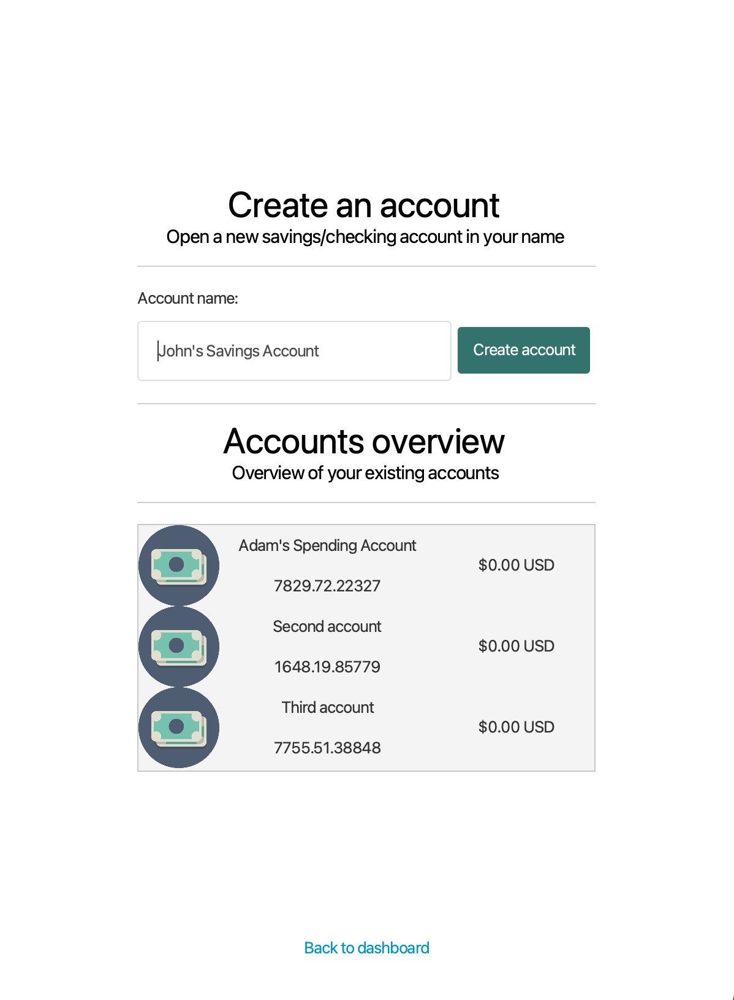

# TDT4100 Project: Finance Manager 💵

## What is Finance Manager ❓

Finance Manager is a Banking Management System written in Java using JavaFX.

## Developer Information 💻

This JavaFX application was a school project for the course TDT4100 (object-oriented programming).

Created by Magnus Rødseth and Julian Grande.

## Running the application ✅

1. Using an IDE of your choice, find the `Edit configurations...` window.
2. Create a new `Maven` configuration.
3. Give your configuration a fitting name.
4. Enter the following into the command line prompt in the window: `clean:clean javafx:run`.
5. Run your configuration.

## Tech stack and plugins 🛠

☕️ Application: [JavaFX with Maven](https://github.com/openjfx/javafx-maven-plugin)  
📦 Local storage: Our custom JSON parser and serializer, as per the project description  
🧪 Testing: [JUnit with Maven Surefire](https://maven.apache.org/surefire/maven-surefire-plugin/examples/junit.html)
<<<<<<< HEAD

## Color Codes 🎨

 midnight-green: #104F55  
 myrtle-green: #32746D  
 cambridge-blue: #9EC5AB  
 dark-green: #01200F  
=======

### Persistent storage 📦

The application supports persistent storage of users, accounts and transactions. These JSON files are located in the
following path: `~/financemanager/storage`.

## Color Codes 🎨

 midnight-green:
#104F55    
 myrtle-green:
#32746D   
 cambridge-blue:
#9EC5AB    
 dark-green: #01200F    
>>>>>>> 40f055a (update path for persistent storage and update readme)
 jungle-green: #011502

## FXML Views 👨‍🎨

